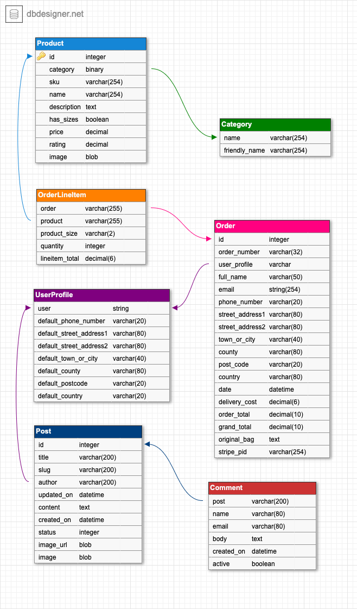

# **Gift Shack**

### About
* Gift Shack is an e-commerce website selling gifts and homeware featuring unique patterns and designs.

Link to website - https://gift-shack.herokuapp.com

### User goals:
* To be able to visit the online store and find unique and original gifts to purchase
* To be able to register an account and login to view their personal profile showing their order history and payment details.
* To be able to easily navigate the site and find products they’re interested in.
* To be able to search for specific products by name, price or category.
* To be able to easily add items to a shopping cart and checkout later once they have finished shopping.
* To feel that they are using a secure and trustworthy site.

### Business goals of the website:
* To generate online sales  
* To provide an excellent overall user experience.
* To make it easy for the user to see and visit the areas of the website that are the most relevant to them via strong UX and UI design.
* To act as the main showcase and home for all current and future products.
* To build a strong, recognisable brand in the giftware market. 

## **UX**

The user types can be defined as but not restricted to the following:

* Shoppers tending towards the broad design led category.
* Shoppers more specifically interested in illustration, art and pattern design products.
* Shoppers looking for gifts in general.
* Shoppers looking for specific categories of products sold in the store. (Mugs, cushions, greetings cards, stationery etc) 
* Buyers representing resellers and marketplaces such as Wayfair, Amazon and other online retailers stocking design led products. 
* Buyers representing independent retailers such as high street gift shops and department stores both on and offline. 

The site has been primarily designed to meet the needs of these user types.
Clear sections which relate specifically to all of the user stories below are built into the website's design.
A mobile first approach was taken to create this project with consideration of ease of use and intuitive navigation to each of the features/sections.

### **User Stories**

| User Story No.               | As a…                     | I want to be able to…                                                 | So that I can…                                                                                  |
|------------------------------|---------------------------|-----------------------------------------------------------------------|-------------------------------------------------------------------------------------------------|
| Views and Navigation         |                           |                                                                       |                                                                                                 |
| 1                            | Shopper                   | View all products at a glance                                         | Choose which ones I’d like to buy                                                               |
| 2                            | Shopper                   | View individual items for sale                                        | Assess the products details prior to purchasing. (Price, product description, available images) |
| 3                            | Shopper                   | View different categories of products                                 | Easily find the types of products I’m looking for                                               |
| 4                            | Shopper                   | View a running total of my chosen products on each page               | Manage how much I spend                                                                         |
| 5                            | Shopper                   | Easily find useful and relevant links                                 | Visit the store's social media pages and blog pages                                             |
| 6                            | Shopper                   | Contact the store owner                                               | Make customer enquiries about products, discounts, refunds, etc.                                |
| 7                            | Buyer                     | Contact the store owner                                               | Enquire about potentially stocking products in other stores both on and offline.                |
| Registration & User Accounts |                           |                                                                       |                                                                                                 |
| 8                            | Site User                 | Register for an account easily                                        | View my personal account profile                                                                |
| 9                            | Site User                 | Log in and logout easily                                              | Access my account and all relevant information                                                  |
| 10                           | Site User                 | Recover my password if I forget it                                    | Regain access to my account easily                                                              |
| 11                           | Site User                 | Receive a confirmation email after I register for an account          | Verify that I registered successfully                                                           |
| 12                           | Site User                 | Have my own user profile                                              | See my order history and know that my payment info is saved                                     |
| Sort & Search                |                           |                                                                       |                                                                                                 |
| 13                           | Shopper                   | Sort all available products                                           | View the products according to price or category                                                |
| 14                           | Shopper                   | Sort a specific category of product                                   | View the products in that category by price or name                                             |
| 15                           | Shopper                   | Search for specific items by their name or product description        | Find a particular product I’m interested in                                                     |
| 16                           | Shopper                   | See my search results                                                 | Check product availability and suitability                                                      |
| Purchasing & Checkout        |                           |                                                                       |                                                                                                 |
| 17                           | Shopper                   | Select the quantity of product easily                                 | Choose how many I would like to purchase                                                        |
| 18                           | Shopper                   | View all items in my shopping cart                                    | Easily see the total cost and the exact items I can expect to receive                           |
| 19                           | Shopper                   | Manually adjust the quantity of items in my shopping cart             | Control the number of items I want and make any final changes prior to checkout                 |
| 20                           | Shopper                   | Easily submit my payment details                                      | Checkout easily and quickly without any problems                                                |
| 21                           | Shopper                   | See a confirmation of my order after checkout                         | Be certain everything went as expected and verify that no mistakes were made                    |
| 22                           | Shopper                   | Receive an order confirmation email following checkout                | Have proof of purchase and a record of the transaction for future reference                     |
| Admin & Store Management     |                           |                                                                       |                                                                                                 |
| 23                           | Store owner/Administrator | Add new product(s)                                                    | List new products to sell in the store                                                          |
| 24                           | Store owner/Administrator | Edit product(s)                                                       | Make necessary changes to product details including images, descriptions, prices etc            |
| 25                           | Store owner/Administrator | Delete product(s)                                                     | Remove products from store when no longer required                                              |
| Blogs & Comments             |                           |                                                                       |                                                                                                 |
| 26                           | Site visitor              | Easily find the website blog articles                                 | Read the ones I'm interested in                                                                 |
| 27                           | Site visitor              | Write a comment about a blog post                                     | Contribute and offer my opinion relating to the article.

---
Further information and screenshots showing how this project meets the user's needs can be
found in the separate [TESTING.md](https://github.com/JohnW876/gift-shack/blob/master/TESTING.md) file.

---
### **Data design**

The schema detailed below was created to help understand the structure of the database and outline how the data in each of the different models relate to each other.
* During development sqlite3 was used to store the database while Heroku Postgres was used during the production phase.

#### **Data Models** 

These models define the data that each will hold and show relationships to other tables via the foreign keys.

**Product Model**
* Holds the data relevant to the products listed for sale and is related to the category model shown via the foreign key.
* This means that when a customer searches for a product by category the data held here can be used to return relevant product information. 

| Field       | Type         |
|-------------|--------------|
| category    | ForeignKey   |
| sku         | CharField    |
| name        | CharField    |
| description | TextField    |
| has_sizes   | BooleanField |
| price       | DecimalField |
| rating      | DecimalField |
| image       | ImageField   |

**Category Model**
* Holds the name data relating to the categories of products such as greetings cards, tea cups, coffee mugs etc.
* The name and friendly name fields distinguish between how the categories are referred to in the code and how they are displayed to the user.

| Field         | Type          |
|---------------|---------------|
| name          | CharField     |
| friendly_name | CharField     |

**Order Model**
* Holds all the data regarding a customer order and as such is related to the user profile model via the foreign key.
* This allows orders to be linked to registered users and is created via the order model in the checkout app. 
* This means that when a registered user views their profile, their related orders are made available using this data. 

| Field           | Type         |
|-----------------|--------------|
| order_number    | CharField    |
| user_profile    | ForeignKey   |
| full_name       | CharField    |
| email           | EmailField   |
| phone_number    | CharField    |
| street_address1 | CharField    |
| street_address2 | CharField    |
| town_or_city    | CharField    |
| county          | CharField    |
| post_code       | CharField    |
| country         | CharField    |
| date            | DateTimeField|
| delivery_cost   | DecimalField |
| order_total     | DecimalField |
| grand_total     | DecimalField |
| original_bag    | TextField    |
| stripe_pid      | CharField    |

**Order Line Item Model**
* Also created in the checkout app, the order line item model helps to generate items in the shopping bag and as such is related to the product and order models to which it has access.  

| Field          | Type          |
|----------------|---------------|
| order          | ForeignKey    |
| product        | ForeignKey    |
| product_size   | CharField     |
| quantity       | IntegerField  |
| lineitem_total | DecimalField  |

**User Profile Model**
* Holds the user data regarding default delivery details and their order history. 
* The OneToOneField type ensures one profile relates to just one user. 

| Field                   | Type        |
|-------------------------|-------------|
| user                    |OneToOneField|
| default_phone_number    | CharField   |
| default_street_address1 | CharField   |
| default_street_address2 | CharField   |
| default_town_or_city    | CharField   |
| default_county          | CharField   |
| default_postcode        | CharField   |
| default_country         | CharField   |

**Blog Posts Model**
* Holds the data relating to each author's blog post. Consequently the author field takes the user in userprofile as a foreign key.

| Field      | Type          |
|------------|---------------|
| title      | CharField     |
| slug       | SlugField     |
| author     | ForeignKey    |
| updated_on | DateTimeField |
| content    | TextField     |
| created_on | DateTimeField |
| status     | IntegerField  |
| image_url  | URLField      |
| image      | ImageField    |

**Comments Model**
* Used to link the comments relating to each blog post and so takes post as a foreign key.

| Field      | Type          |
|------------|---------------|
| post       | ForeignKey    |
| name       | CharField     |
| email      | EmailField    |
| body       | TextField     |
| created_on | DateTimeField |
| active     | BooleanField  |

---
### **Wireframe mockups:**
Below is a link to the project's wireframe mockups which were created using Balsamiq Wireframes software prior to development to help with visualisation of features and layout. 

https://github.com/JohnW876/gift-shack/tree/master/documentation/wireframes
 
Wireframe mockups were created at mobile, tablet and desktop sizes and I referred to them throughout development. 

---
### **User Expectations:**
* What will they expect to see? - Users will expect to see an intuitive app with accessible features and a well designed user interface. 
* Does the site look credible and trustworthy? - Many elements will contribute to the first impression of a trustworthy site. These include, clear and intuitive navigation, good design and functionality. 
* Does the site offer what the user wants? - The features will need to meet the user's goals whilst delivering expected functionality and a valuable user experience.
* Does the site seem valuable enough for users to stay and return? - The features, functionality, usability and design will need to meet or exceed expectations to provide the value needed to ensure continued usage.  
  
---
### **Market Research:**
* I researched the gift market online and compared a number of e-commerce gift websites to get a feel for the UX and UI.

### **Visual Design:**
* Colour scheme - I limited the colours to blue, black and white. I wanted to allow the products to be the focus and so I deliberately kept the palette to a minimum. These are also colours which complement and support the colour in the artwork of the products without pulling your attention from them. 
* Typography - I chose a clean sans serif font of Barlow from Googlefonts for the type which I used throughout the site. 
* Accents - I have used the blue in buttons, icons, hover links and page headings. I've used white for the page background for a simple, classic gallery style and I've used black for the banner and main body type. 
 --- 
## **Features**

The following project features were included to meet the needs outlined in the user stories above. 

* Responsive navbar featuring navlinks to all main pages (Home, Gifts, Contact, Blog).
* My Account icon on home page featuring menu dropdown for users (Register, Login and My Profile) and superusers (Product Management).
* Shopping basket icon on homepage to view shopping cart and updates automatically with running total of added products.
* Search form on homepage to allow users to search for products by category or product description keywords. 
* Responsive navbar with navbar toggler on smaller screens.
* Large callout on homepage with button to go straight to products.
* Homepage carousel featuring fade transitions between featured products and JQuery interactive flip animation on touch or mouse over.
* Responsive footer with links to social media, latest blog posts and contact page. 
* Toast messages feature to inform the user of key events throughout the site such as adding, deleting and updating products, adding or removing items from the shopping basket, signing in or out.
* Products page featuring sort functionality by price, rating, product name and product category.
* Pagination feature which limits the individual products on a given page to a maximum of 12 and provides links to navigate through the remaining products.
* Product detail page which displays product images and descriptions, quantity changer buttons and links to add products to the shopping bag or keep shopping.
* Shoppping bag with details of products added as well as subtotal, grand total and quantity buttons with update or remove from bag functions. Also features links to checkout or keeep shopping.
* Shopping bag notification of amount required to meet the free delivery threshold. 
* Secure checkout with order summary and forms to gather customer details, delivery information and card payments using Stripe. Links to create an account or login are here also with links back to adjust the shopping bag or to complete the order.
* Order confirmation page featuring order and delivery details. Email confirmation sent to customers automatically following successful checkout. 
* User Profile functionality featuring order history default delivery details and button to update information. 
* Sign in form with link to password reset page.
* Superuser Product Management page with form to add new products and product images.
* Superuser Product Management page with form to edit products and product images.
* Superuser access to edit and delete products from the site via the products pages. 
* Blog page featuring posts and click through button to see each post in more detail. Posts can only be written by superuser. 
* Blog comments section on blog detail pages with submission form for site visitors.
* Contact page featuring contact form with email validation. 
 

### **Features to implement in future**
When considering the trade off between importance and viability, the following features could not be implemented at this stage but would make valuable additions in future and improve the user experience.

* I would like to implement a newsletter feature to notify customers of new products, new designs and  website updates etc. 
* If the site goes live I would need to add all of the necessary docs such as FAQ's, Terms and Conditions, Returns and privacy policies etc. 

---
## **Languages Used** 
* HTML, CSS, Javascript and Python are used in this project.
---
## **Technologies Used**
* [Gitpod](https://www.gitpod.io/) Gitpod IDE was used to develop the website.
* [Bootstrap](https://getbootstrap.com/) A front-end framework used to help build the site and make it responsive on all devices.
* [FontAwesome](https://fontawesome.com/v4.7.0/) Icons were used in social links and forms. 
* [Google Fonts](https://fonts.google.com/) Font styles chosen for the website were sourced from here. 
* [Balsamiq Wireframes](https://balsamiq.com/) Used pre-development to help with UX/UI design and consulted throughout development.
* [Chrome DevTools](https://developers.google.com/web/tools/chrome-devtools) To inspect the code, test the data and preview changes on all device sizes.
* [Django](https://www.djangoproject.com/) A python web framework which was used to help build the site. 
* [Django Crispy Forms](https://django-crispy-forms.readthedocs.io/en/latest/) Used to style and control how the site's forms are rendered. 
* [Django-allauth](https://django-allauth.readthedocs.io/en/latest/) A set of Django applications used for the site's authentication, registration and account management. 
* [Django template language](https://docs.djangoproject.com/en/3.1/ref/templates/) Used to dynamically generate HTML templates.
* [Stripe](https://stripe.com/gb) Used for secure online payment processing. 
* [Sqlite3](https://sqlite.org/index.html) To store the database during development.
* [Heroku](https://www.heroku.com/) To host and deploy the site.
* [Heroku Postgres](https://www.heroku.com/postgres) To store the production database.
* [AWS](https://aws.amazon.com/) Amazon Web Services stores the static files as well as the media images.

---
## **Testing**

Information regarding testing can be found in this separate [TESTING.md](https://github.com/JohnW876/gift-shack/blob/master/TESTING.md) file.

---
## **Deployment**

Gift Shack was developed with the Gitpod IDE and then pushed to a GitHub repository. The website is deployed via Heroku.

To deploy the website locally starting from GitHub:

**Git Clone**

1. Navigate to the github repository via this link - https://github.com/JohnW876/gift-shack
2. Click on the green dropdown labelled Code.

3. The box will display as below.

4. Copy the URL in the box to clone with HTTPS.

5. Open your preferred IDE (Integrated development environment).

6. Change the working directory to the location you want the cloned directory to be made.

7. Type git clone and paste the URL from step 4.

8. Press enter to create your local clone. 

9. In your IDE ensure your environment variables contain the following which can be obtained from a [Stripe](https://stripe.com/gb) account:

10. Type the following command in the terminal: pip3 install -r requirements.txt

11. Finally, migrate using the command -  python3 manage.py migrate

**Deploy to Heroku**
1. Install gunicorn, psycop2-binary and dj-database-url using pip3 install.

2. Type the folowing command in the terminal to freeze these in to requirements file - **pip3 freeze > requirements.txt**

3. Now create a Procfile and add -  **web: gunicorn gift_shack.wsgi:application**

4. Add and commit the requirements file and Procfile and then git push to GitHub.

5. Now go to [Heroku](https://id.heroku.com/login) and log in.

6. From your dashboard in Heroku, click on the 'New' button as shown below and select Create new app.

7. Give the app a name, select your region and then click create app.

8. From the dashboard of the new app, under the Deploy tab, next to Deployment Method, select Github - Connnect to Github.

9. Below in the Connect To Github section, search for the correct repository and then connect.

10. In the dashboard of the app under 'Settings', click  'Reveal Config Vars'

11. Input the same values in Heroku Config Vars as those stored in environment variables.

12. In the 'Deploy' tab choose a branch to deploy and click 'Enable Automatic Deploys' Once enabled, it will look like this:

13. In the Resources tab of the app search for Heroku Postgres in the add-ons section and submit the resulting order form to add Postgres to the app.

14. Click open app at the top of the page to view the newly deployed app. 

AWS 
---

## **Credits**

### **Content**
All site content was written by John Withey.

### **Media**
All images used in this project were created by John Withey. 

### **Code**
Code for the project was used from the following sources:

 - Home Page - Bootstrap for navbar toggler

 - Footer - Code from the footer was taken from here and modified

 - more specifically used for the footer

 - Easy Sticky footer - Code was modified from here to help make the footer stick to the bottom of page. 

 - Products page - Bootstrap for nav items used to help create framework for dropdown selectors and sort selector.

 - For Nav bar dropdown button and menu

 - Carousel from Bootstrap

 - Toasts from Bootstrap

 - Blog and comments modified from

 - Contact page from here

 - Pagination code modified from here originally

 - Installed older version of pagination from here as new version not supported by Heroku

 - Animated homepage carousel code from

---
### **Acknowledgements**
As an artist and illustrator I wanted to design and build a website that I could actually use to help promote and sell the products that I create.
It's been fun and a great challenge to produce an app that has real world value and will be used to hopefully generate sales in the future.
I'd like to thank my mentor Aaron Sinnott, once again, for helping with positive and constructive feedback during the project and throughout the course! 
