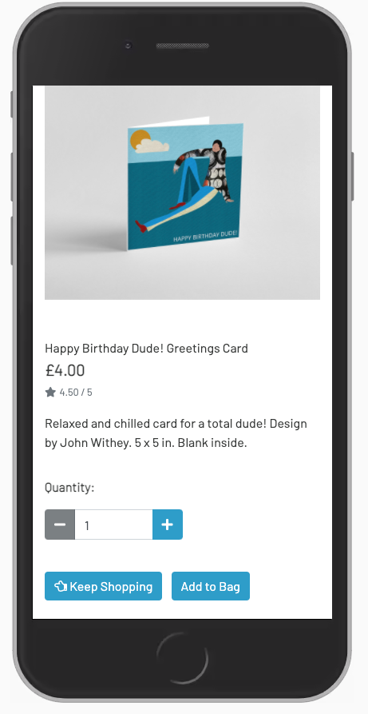
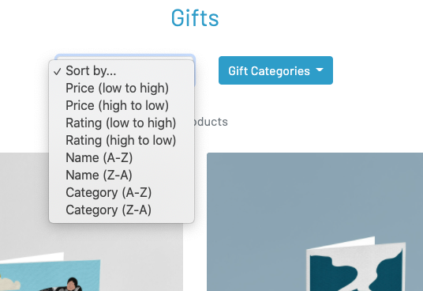
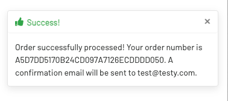
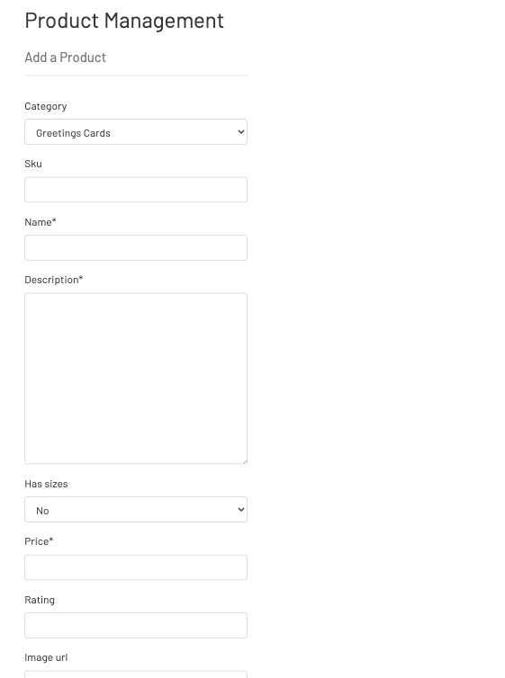

**Testing During Development**

**To test allauth was working.**
* After installing allauth settings in settings.py, I temporarily changed the login redirect url in settings.py to '/success' and ran the server in order to open the project in the browser from Gitpod.
* I then created and verified an email login manually in the django admin.
* Next, I logged out of the admin and navigated to the login page and attempted to login with the previously created superuser to verify if it would redirect back to a 404 page which it did.
* This confirmed allauth was working as the login system redirected back to the login redirect url of '/succcess' in settings.py. 
* I then reset the login redirect url to '/' once allauth was verified.

**Testing the home app.**
* To verify that the index template was extending the base template and that Bootstrap was also working, I added a heading with some basic Bootstrap classes to a content block in index.html.
* After creating a view to return the index page, adding the url's, importing the correct settings and wiring up the template directories, I was able to verify that the home page rendered successfully in the browser with the heading and specified Bootstrap styles.

**Testing the main page header.**
* After adding the the main header to base.html I ran the server and opened the browser to verify it had correctly rendered.
* I verified the search bar functionality by running a test query. This successfully added a parameter to the url to verify it was working.

**Testing the product app.**
* When setting up the product models for categories and products I signed in to Django admin area to verify the category and product models were displaying correctly.
* I manually added the product details and images to the database via the Django admin and verified the images were added to the media file in Gitpod. 
* I was able to verify that the 'products' template was being rendered correctly by using the /products url endpoint and confirming the query set of 'products' was displayed in the browser.
* After setting up 'all products' in the template I was able to verify in the browser that all product images and data were rendering correctly. 

**Testing the search form.**
* After setting up the query request in the all products view, I ran a search to verify if all products with the search term 'coffee' in either the product name or description would be returned.
* The results successfully returned both a greetings card with 'coffee' in the title and all of the coffee mug products.

**Testing the Shopping app.**
* When setting up the functionality for the shopping app I was able to verify the context processor was working by checking the delivery banner was returning the correct variable on the home page.
* In order to verify that items from a session were successfully added to the shopping bag I printed the product id and quantity details to the console via the add_to_bag view. 

**Testing the toasts.**
* This was tested by changing the add_to_bag view to use each toast template (success, error, info and warning). When an item was added to the shopping bag I verified the relevant category of message was displayed correctly.

**Testing Checkout and Stripe set up.**
* During set up I printed the payment intent to the console to verify it was working.
* In the browser I navigated to the checkout and filled out the form using test customer details, delivery information and test card details.
* After submitting the form I navigated to the events section in the Stripe dashboard to verify that a new payment had been successful.
* I also verified in the Django admin that test orders were registering and that the correct order totals and delivery costs were displayed.

**Testing Stripe Webhooks.**
* I created a new endpoint in Stripe with the url from my browser. This revealed the webhook signing secret which I then exported from my workspace terminal. I restarted the server and in Stripe clicked send test webhook. This was confirmed as successful in the Stripe dashboard and also printed successfully to my console. 
* I further tested event types in Stripe. I tested for unhandled webhook, payment intent succeeded and payment failed by sending test webhooks for those events from Stripe. Stripe confirmed the webhooks were all sent successfully.  
* I printed the payment intent to the console from Stripe once I submitted an order to verify it contained the meta data, billing and shipping information. This confirmed the information was securely passed from the form to Stripe via the payment intent.

**Testing Registration.**
* I registered a test user account using the sign up form. The confirmation email was logged to the console in Gitpod. From this I could copy the confirmation link in part and add to the end of the running site's url. This took me to the confirmation email page so that I could log in. 

**Testing Profiles.**
* To verify the profiles app was working I successfully rendered the test username in the profile page.
* To verify if a user's order history would attach to their profile I completed an order with the save info box checked. Navigating to My Profile, the order history successfully displayed the order details.
* To verify the user's details would prefill the form in secure checkout, I completed a new order whilst logged in as a registered user. I updated full name in the Django admin. The form on the secure checkout page successfully prefilled the form with all user details. 
* To verify the webhook can handle checkout functionality if the checkout view fails, I commented out form.submit to simulate a broken form. I then submitted an order to verify that it would be successfully processed. This was confirmed with Stripe posting the webhook URL to the terminal. I also verified that the order was created in Django admin.

**Email Confirmation**
* A test purchase was made to verify that the confirmation email would be logged in the console with all of the correct order details. 
* Following Gmail set up I registered a test user to verify that they would receive a confirmation email to a test email address and then be able to login. 

**Add Product set up**
* To verify if the appropriate error message would display when adding a product I submitted a form for an invalid product by adding more than 6 digits to the price. The appropriate error message displayed as expected. 
* A valid product was added using the form in Product Management to verify if it was added to products with and without an image. The success message displayed. This was confirmed when checking the products in Django admin. 

**Edit Product set up**
* To verify if the appropriate error message would display when editing a product, I submitted an invalid update by adding more than 6 digits to the price. The appropriate error message displayed as expected.
* A valid price was entered into the price field and submitted to verify if the success messsage would display.

**Delete Product set up**
* A product was added via the form with valid details and if successful redirected to the product detail page with product id in the URL. Changing the URL to products/delete/id verified that the admin user would be redirected back to the products page and the correct toast message of 'product deleted' was displayed.

**Testing blog app and comments**
* I manually entered blog posts and comments in Django admin and verified the blog app was working by rendering the posts and comments in the browser.
* After submitting a valid form in the comments section, I approved the comments in Django admin and verified that they displayed under their appropriate blog article in the browser.

**Testing Contact form email**
* After successfully rendering the contact template in the browser I submitted a valid form to verify if it would send the test email to the console locally. 
* After deployment a valid contact form was submitted from the live Heroku site to verify that it would be successfully delivered to the smtp gmail account I set up.

I continually tested how the page was rendering across all device sizes using Chrome DevTools.

--- 
### **User Story Tests**
The following section shows how the project meets the user's needs as outlined in the user stories and illustrates these with screenshots of the finished project. 

**1. As a shopper, I want to be able to view all products at a glance so that I can choose which ones I’d like to buy.** 

These user's needs are met via:
* The main nav menu 'GIFTS' takes users to view all products.

**2. As a shopper, I want to be able to view individual items for sale so that I can assess the product details prior to purchasing. (Price, product description, available images).** 

These user's needs are met via:
* Product detail page

**3. As a shopper, I want to be able to view different categories of products so that I can easily find the types of products I’m looking for.**  

These user's needs are met via:
* Categories selector on the products page.

**4. As a shopper, I want to be able to view a running total of my chosen products on each page so that I can manage how much I spend.** 

These user's needs are met via:
* The Shopping Basket icon features on every page with a running total.

**5. As a shopper, I want to be able to easily find useful and relevant links so that I can visit the store's social media pages and blog pages.** 

These user's needs are met via:
* The footer featuring links to social pages and blog.

**6. As a shopper, I want to be able to contact the store owner so that I can make customer enquiries about products, discounts, refunds, etc.** 

These user's needs are met via:
* The contact page with contact form. 

**7. As a buyer, I want to be able to contact the store owner so that I can enquire about potentially sourcing Gift Shack products for the store(s) that I represent.**  

These user's needs are met via:
* The contact form on the contact page
* Store contact details in the footer.

**8. As a site user, I want to be able to register for an account easily so that I can view my personal account profile.** 

These user's needs are met via:
* My Account icon with dropdown menu to Register.
* Signup form.

**9. As a site user, I want to be able to log in and log out easily so that I can access my account and all relevant information.**  

These user's needs are met via:
* Sign In Form
* Logout from My Account Icon menu
* Sign out page.

**10. As a site user, I want to be able to recover my password if I forget it so that I can regain access to my account easily.**  

These user's needs are met via:
* Password reset page

**11. As a site user, I want to be able to receive a confirmation email after I register for an account so that I can verify that I have registered successfully.** 

These user's needs are met via:
* Confirmation email sent notification and toast message.

**12. As a site user, I want to be able to have my own user profile so that I can see my order history and know that my payment info is saved.** 

These user's needs are met via:
* The Profile page.

**13. As a shopper, I want to be able to sort all available products so that I can view the products according to price, category or rating.**  

These user's needs are met via:
* Sort selector on the products page

**14. As a shopper, I want to be able to sort a specific category of product so that I can view the products in that category by price, name or rating.** 

These user's needs are met via:
* The category selector on the products page.

**15. As a shopper, I want to be able to search for specific items by their name or product description so that I can find a particular product I’m interested in.**  

These user's needs are met via:
* The search bar at the top of the page.

**16. As a shopper, I want to be able to see my search results so that I can check product availability and suitability.** 

These user's needs are met via:
* Search results displayed in products page along with the number of products.

**17. As a shopper, I want to be able to select the quantity of product easily so that I can choose how many I would like to purchase.**  

These user's needs are met via:
* The quantity selector on the product details page.

**18. As a shopper, I want to be able to view all items in my shopping cart so that I can easily see the total cost and the exact items I can expect to receive.** 

These user's needs are met via:
* The Shopping Bag. 

**19. As a shopper, I want to be able to adjust the quantity of items in my shopping cart so that I can control the number of items I want to buy and make any final changes prior to checkout.**  

These user's needs are met via:
* Quantity selectors and update/remove buttons in shopping bag.

**20. As a shopper, I want to be able to easily submit my payment details so that I can checkout easily and quickly without any problems.** 

These user's needs are met via:
* Stripe card payment form in the checkout.  

**21. As a shopper, I want to be able to see a confirmation of my order after checkout so that I can be certain it was processed as expected and verify that no mistakes were made.** 

These user's needs are met via:
* Order confirmation details.

**22. As a shopper, I want to be able to receive an order confirmation email following checkout so that I can have proof of purchase and a record of the transaction for future reference.** 

These user's needs are met via:
* A confirmation email is sent to the user when an order is made.  
* Toast message confirms this on screen. 

**23. As a store owner/administrator, I want to be able to add new products so that I can list them to sell in the store.** 

These user's needs are met via:
* Product Management - Add Product form.

 Top of Form (Above)

 Bottom of form (Above)

**24. As a store owner/administrator, I want to be able to edit products so that I can update and make necessary changes to product details.** 

These user's needs are met via:
* Edit products form in Product Management.

Top of form (Above)

Bottom of form (Above)

**25. As a store owner/administrator, I want to be able to delete products so that I can remove them from the store when no longer required.** 

These user's needs are met via:
* Delete buttons on the product and product detail page for superusers. 

**26. As a site visitor, I want to be able to easily find the website blog articles so that I can read the ones I'm interested in.** 

These user's needs are met via:
* The Blog page and blog details page.

Blog Posts (Above)

Blog details (Above)

**27. As a site visitor, I want to be able to write a comment about a blog post so that I can contribute and offer my opinion relating to the article.** 

These user's needs are met via:
* Blog comments underneath the posts and the comment submission form below.

### **Interactivity Tests**
The following tests were carried out on mobile, tablet and desktop devices to confirm that all interactive parts of the site are working as expected:

**1. Homepage**

	i.  On the homepage move the mouse pointer over each of the main nav links to verify that the white type turns to black.

    ii. Click in the search bar to verify that the border lights up blue. 

	iii. Hover over the search button to verify the background colour turns black and the icon remains white.
        
	iv. In the search bar itself, type a keyword such as 'tea' and click the search button to verify that relevant search results are returned.

    v. From the main call out on the homepage, roll the mouse pointer over the Browse Gifts button to verify that the background colour turns black.

    vi. Click the browse gifts button on the home page to verify the browser navigates to the GIFTS page.

    vii. Click the HOME button to verify the browser navigates to the home page again and verify that the animation on the carousel is triggered.

    viii. Roll the mouse pointer over the carousel to verify that the animation is triggered and causes the image to spin.

    ix. Without registering for an account, click the My Account icon to verify the dropdown menu is displayed with Register and Login options.

    x. Click each of these menu items in turn to verify you are taken to the signup and login pages respectively before returning to the home page via the HOME nav link.

    xi. Click on the remaining main nav links to verify the browser navigates to the appropriate page. 

    xii. From any of these main pages click the GIFT SHACK logo to verify that the browser navigates back to the homepage. 
 
The above tests were carried out and no errors were found. 

**2. Footer**

    i. In the footer, move the mouse pointer over the social icons and blog post links to verify they turn blue.

    ii. Hover over the CONTACT US link to verify the white underline appears.

The above tests were carried out and no errors were found.     

 **3. Sign up form**  

    i. From the My Account icon, click the register option to verify the sign up form appears. 

    ii. Scroll over the buttons to verify the backgound colour turns black.

    iii. Try to submit an empty form to verify the tooltip appears asking the user to please fill in this field.

    iv. Now submit a valid form to verify that a new screen appears asking you to verify your email address and toast alert message appears re email confirmation.

    v. After confirming email, navigate to login page and attempt to login using credentials to verify the success toast message appears to say successfully signed in.

The above tests were carried out and no errors were found. 

**4. Products page**  

    i. Navigate to the GIFTS page to verify all products are displayed with paginated pages of 12 products maximum per page. 

    ii. Click on the pagination page numbers to verify the browser navigates to each page of remaining products. 

    iii. Hover over the Gift categories dropdown button to verify the background colour turns black.

    iv. Now click the categories dropdown and click each of the categories in turn to verify the correct products are displayed with heading displaying number of products. 

    v. Select all gifts from the category selector. Now click on the sort selector button and select each of the options in turn to verify that the correct order of products is displayed.

    vi. Select an individal product by clicking on it to verify the product detail page is diplayed. 

    vii. On this page, hover over the buttons to verify the background colour turn black.

    viii. Click the quantity selector buttons to verify the quantity increases and decreases accordingly. 

The above tests were carried out and no errors were found. 

**5. Shopping bag**      

    i. Click the add to bag button to verify that the success toast message appears and the shopping bag icon updates to the correct amount. 

    ii. Now click the shopping bag icon to verify the shopping bag page appears. 

    iii. Click the quantity buttons to verify the amount increases and decreases. Now click update to verify the totals update accordingly and the success toast appears. 

The above tests were carried out and no errors were found. 

**6. Checkout**    

    iv. From the shopping bag click the secure checkout button to verify you arrive at the checkout page. 

    x. Try to submit an empty form to verify if tooltips appear to ask you to fill in the form.

    vi. Now submit a valid form with test card payment of alternate 4 and 2 numbers from left to right to verify the loading spinner appears and you arrive at the order confirmation page with toast message confirming the order.

    vii. Now click the back to home button to verify you arrive back at the home page.  

    The above tests were carried out and one error was found. The loading spinner did not display during the checkout process. See issues and fixes below. 

 **7. Contact page**    

    i. Navigate to the contact page and try to submit an empty form to verify the tooltip will appear to ask you to fill in the form. 

    ii. Now fill in a valid form and try to submit to verify you arrive at the success page. 

The above tests were carried out and one error was found. The user did not arrive at the success page but was redirected straight to home page. See issues and fixes below. 

**8. Blog posts, details and comments** 

    i. Navigate to the BLOG page via the main site nav to verify the user arrives on the blog posts page listing all current available posts. 

    ii. Hover over the 'Read More' button to verify the background turns black.

    iii. Click the 'Read More button to verify the user arrives at the blog's detail page. 

    iv. Scroll down to verify that comments are listed below and that the leave a comment form is displayed.

    v. Attempt to submit an empty form to verify that the tooltip appears to ask the user to fill in the field. 

    vi. Submit a valid form to verify if the green message appears to inform the user that "Your comment is awaiting moderation". 

The above tests were carried out and no errors were found. 

**9. User sign out**

    i. From the My Account icon click and select the Logout option to verify that the user arrives at the Sign Out page. 

    ii. Click the sign out button to verify that the user is returned to the home page and the success toast message is displayed. 

The above tests were carried out and no errors were found. 

**10. User Profile Page**

    i. Sign in as a registered user and click the My Account icon followed by the My Profile option to verify the user arrives at the My Profile page. 

    ii. Follow the process above to add a product to the shopping bag, complete all the required details and continue through to a successful checkout.

    iii. Now navigate back to the profile page to verify the default delivery details you submitted are displayed and so is the order in the order history.

The above tests were carried out and no errors were found. 

**11. Superuser**

    i. Using the provided superuser credentials, login to verify the success toast message appears to confirm you are logged in.

    ii. Click on My Account and selectProduct Management to verify you arrive at the Product Management page with Add a product form. 

    iii. Attempt to submit an empty form to verify that the tooltip appears to ask you to fill in the fields. 

    iv. Submit a valid form without a product image to verify that the success toast message displays and you arrive at the product detail page.

    v. Click the red delete button to verify that the product is deleted and the success toast message appears to confirm this. 

    vi. Navigate to the GIFTS page to verify that Edit and Delete buttons appear for every product.

    vii. Click the edit button to verify that you arrive at the Edit product form with an alert toast message to confirm you are editing. 

    viii. Make some changes to a product and click update to verify that the changes have been made. 

    The above tests were carried out and no errors were found. 

## **Responsiveness**

**Mobile:**

* 
  
* 
* 
* 
* 
* 
* 

**Tablets:**

* 
* 
* 
* 
* 
* 
* 

**Desktop:**

* 
* 
* 
* 
* 
* 

## **Device Testing**

The website was tested on the following devices:

### **Mobile**

* Apple iPhone XR using Safari on IOS 14.3
* Apple iPhone 7 using Safari on IOS 11.3.1
* Apple iPhone 8 using Safari on IOS 13.4
* Motorola Moto E5 using Google Chrome on Android 8.1
* Google Pixel 3A using Google Chrome on Android 10
* Google pixel 3XL using Google Chrome on Android 10

### **Tablets**

* Apple iPad Air 2 using Safari on IOS 13.5.1
* Microsoft Surface Pro on Windows 10 Pro (Tested on Microsoft Edge & Google Chrome)

### **Desktop** 

The website was tested on the following browsers on Apple iMac running OS Catalina 10.15.7 :

* Google Chrome - VVersion 87.0.4280.88 (Official Build) (x86_64)
* Apple Safari - Version 14.0 (15610.1.28.1.9, 15610)
* Mozilla Firefox Version 78.0.1 (64-bit)

The website displayed well on all of the above browsers and devices. 
All interactive elements were tested and found to be working correctly except for the issues detailed below.

### **Issues**
1. The loading spinner did not display during the checkout process.
2. User did not arrive at the successfully submitted page for the contact form after submitting a valid form. 

### **Fixes**
1. This issue is now resolved. There was a jinja template missing which prevented the css from working.
2. This issue is now resolved. I decided to add a toast message to confirm to the user that the contact form message had been successfully sent. 

### **Code Validators:**

The following websites were used to validate the code and there were no errors except for a single line indentation in python code that was easily fixed:
A few warnings were displayed with the html validator but these related to Jinja templating being in the code as it was unexpected. There were no errors in the html itself. 

HTML - [W3C Markup Validation Service](https://validator.w3.org/#validate_by_input)

CSS - [W3C CSS Validation Service](https://jigsaw.w3.org/css-validator/)

Javascript - [JSHint javascript code analysis](https://jshint.com/)

Python - [PEP8 Online Check](http://pep8online.com/)
